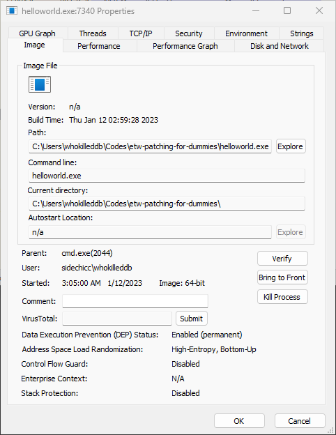
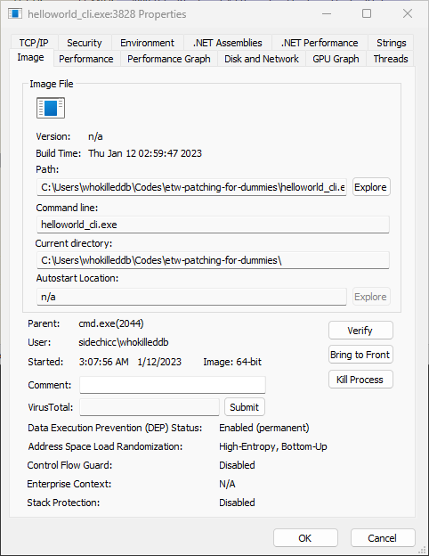
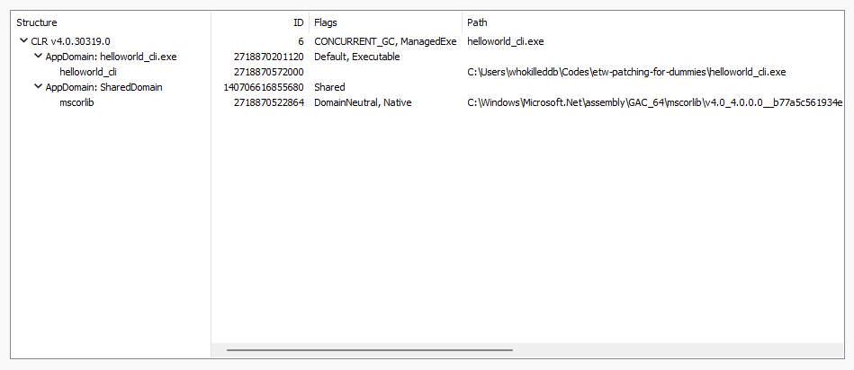
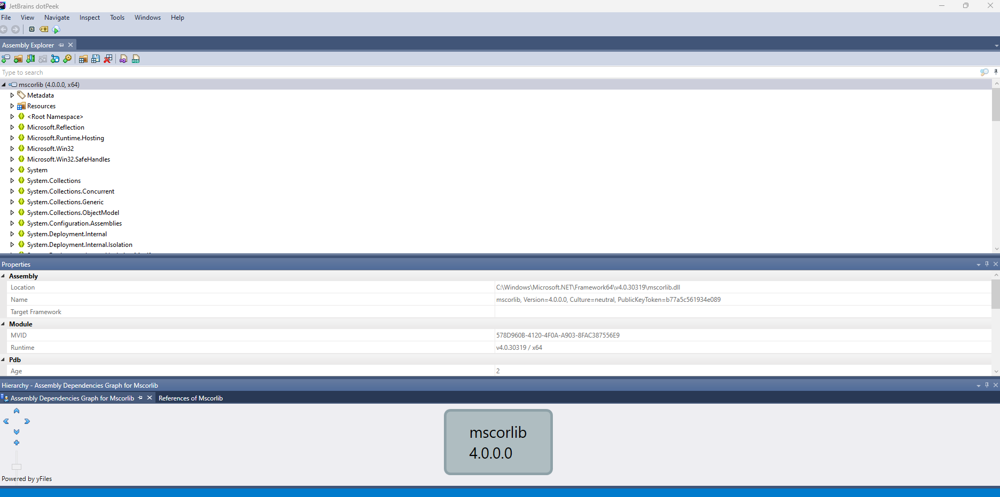
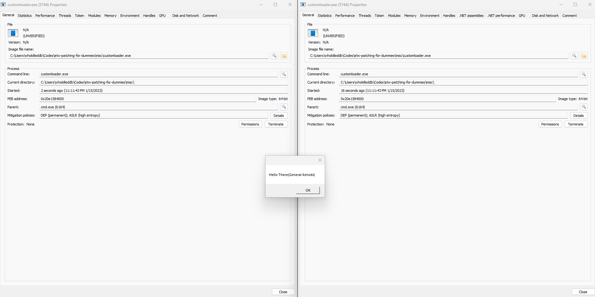

# ETW Patching For Dummies

## Introduction to all things ETW

When initially getting into ETW and patching it, I was not prepared for what was coming. It was a deep rabbit hole of `.NET`, `CLR` and `Windows Internals`. Coming from a pure-`C` background(and a bit of `Rust`), this was a deep hole I was not prepared for at all. This blog is supposed to be more of a Journal than a tutorial as I try to figure things out! So, if you are someone who is as lost as I am, with Zero knowledge of the `.NET Framework` or any of the `C#` stuff and want to go around patching stuff, welcome to the journey.

*PS: There will be a scramble of topics in no particular order, mostly discussing topics relevant to the cause.*

## First-things-first: Show and Tell - The .NET FRAMEWORK
So, when I started writing this blog, I had no idea what `.NET` really was. All knew was that its _some-sorta_ framework by Microsoft for doing windows stuff. Turns out, it is a framework for `C#` and a version of `C++` called `C++/CLI`, which can be compiled with `Visual C++` on Windows. Here, my first question was, *"Hey, then how is it different from normal C++ code?"* 

And to solve that question, I decided to do what all good devs would have done: write a _"Hello World"_ program in both styles.

**Native C++**
```cpp
// helloworld.cpp
#include <iostream>
#include <thread>
#include <chrono>
using namespace std;

int main() 
{
    std::cout << "Hello, World!" << std::endl;
    std::this_thread::sleep_for(std::chrono::seconds(100));
    return 0;
}
```
**C++/CLI**
```cpp
// helloworld_cli.cpp
#using <mscorlib.dll>
using namespace System;
using namespace System::Threading;

int main()
{
    Console::WriteLine("Hello, World!");
    Thread::Sleep(100000);
    return 0;
}
```
Both of these can be compiled with `cl.exe` aka the `Visual Studio Compiler` as such:

```powershell
> cl.exe helloworld.cpp /EHsc
> cl.exe helloworld_cli.cpp /clr
```

This should give us two binaries: `helloworld.exe` and `helloworld_cli.exe`, both of which print the same `"Hello, World!"` statement and then go to sleep. The sleep part is there to give us enough time to examine the process. 

The first thing which I noticed was that the `C++/CLI` excutable was much smaller than the native `C++` executable.

```bash
10-01-2023  15:19           242,688 helloworld.exe
10-01-2023  04:49            32,256 helloworld_cli.exe
```
This is becase when you compile a C++/CLI program, the resulting executable is actually a combination of native machine code and `managed code`.

`Managed code` is code that runs under the control of the `.NET` runtime, which provides a number of services such as memory management, exception handling, and type safety (we would talk more about this later). Because the runtime provides these services, managed code does not need to include the same kind of infrastructure that is required for native code.

As a result, `C++/CLI` executables are typically smaller in size than native `C++` executables. This is because they don't need to include memory management, exception handling and other related implementations themselves, which are provided by the runtime.

Additionally, C++/CLI codes makes use of the `CLR` (another thing we would get to later) which is a part of the `.NET` Framework, this framework ships with the operating system, as such `C++/CLI` application does not require any additional runtime or library dependencies.

Looking at each process in [Process Explorer](https://learn.microsoft.com/en-us/sysinternals/downloads/process-explorer), we see the following:





The first thing I noticed was that the `C++/CLI` executable has two extra tabs: 
- `.NET Assemblies` - This feature allows you to view the `.NET` assemblies that are loaded in a specific process. The tab displays information such as the assembly name, version, and location, as well as the classes and methods that are present in each assembly. This information can be helpful for troubleshooting issues with `.NET` applications, as well as for understanding the internal workings of a process.
  
- `.NET Performance` - This feature allows you to view performance statistics for the `.NET Framework` in a specific process. The tab displays information such as the number of `.NET` objects and exceptions, the number of GC collections, the amount of memory allocated, and the CPU time consumed by the `.NET` runtime. This tab also allows you to view performance counter metrics for the `CLR` such as the number of bytes in all heaps and the current number of Gen 0, 1 and 2 collections. This information can be helpful for diagnosing performance issues in `.NET` applications, such as high memory usage or poor garbage collection behavior.

Only the first one is of interest to us for now. The tab contains the following information:


First things first, notice the `CLR` version. We will talk about `CLR` later either ways. Next up, notice the flag values adjacent to the `helloworld_cli.exe` name. The `CONCURRENT_GC` means that the garbage collector runs concurrently with the application, which can help to reduce the amount of time that the application is paused while the garbage collector is running. Next comes the `ManagedExe` flag which signifies that the executable runs using the `CLR`. Another interesting word which keeps popping is `AppDomain`. 

> An AppDomain, short for Application Domain, is a lightweight and isolated execution environment within a process in the .NET Framework. It allows multiple applications to run within a single process while maintaining isolation and security between them.

So, it's like a logical isolation. I like to think of it to be loosely akin to Linux `namespaces` but more dotnet-y. Moving on, we see another `AppDomain` by the name of `SharedDomain` in there with `mscorlib.dll`. I really like [The Moth's Explanation](http://www.danielmoth.com/Blog/mscorlibdll.aspx) of the name: ms(Microsoft)-cor(Common Object Runtime)-lib(Library) [yeah yeah its ms stands for multilingual standard now, but the original name makes more sense].  According to [this thread](https://social.msdn.microsoft.com/Forums/vstudio/en-US/92a0c975-e350-4d8d-af8e-36ec0ad6c95c/specific-purpose-of-mscorlib-dll-in-net?forum=clr) on microsoft's forums, this library contains the various namespace defintitions (so, much like kernel32/ntdll for normal programs?).



I believe this is a good introduction to the land of `.NET`, but before we talk further, we need to discuss about `CLR` and `Managed Code`.

# The CLR: Common Language Runtime

The `CLR` is the Virtual Machine component of the `.NET Framework`. It is  responsible for executing `Managed` code. It provides a layer of abstraction between the application and the operating system, allowing the application to run in a more secure and stable environment. The `CLR` also provides a number of services to the application, such as memory management, thread execution, security, and code execution. 

One of the more important components which the `CLR` contains is a JIT compiler which is responsible for converting `MSIL` (Microsoft Intermediate Language) code, which is the intermediate language generated by the compiler when the source code of a `.NET` application is compiled, into native machine code that can be executed by the computer's hardware..

## MSIL - A Short Note

`MSIL` (Microsoft Intermediate Language) is a low-level programming language used in the `.NET Framework`. It is an intermediate language between the source code of a program and the machine code that is executed by the computer.

When a `.NET` application is compiled, the source code written in languages such as `C#` or Visual Basic is transformed into `MSIL`. `MSIL` is a platform-independent language, meaning that the same `MSIL` code can be executed on different platforms and architectures, such as Windows, Linux, or macOS, as long as the `.NET Framework` is installed.

`MSIL` contains instructions that are executed by the `CLR` (Common Language Runtime) at runtime, rather than being executed directly by the computer's hardware. This allows the `CLR` to provide services such as memory management, security, and code execution, to the application.

`MSIL` also contains metadata, which is data about the types, members, and other elements in the code. The metadata is used by the `CLR` to determine the types and members that are used by the application, to resolve dependencies, and to enforce security policies.

It's important to note that, `MSIL` code is not executed directly by the hardware, instead it is compiled to native code at runtime by the JIT (Just-In-Time) compiler, which is a component of the `CLR`. This allows the code to be optimized for the specific hardware and operating system that it is running on, which results in more efficient execution.

## Managed Code

Managed code in the .NET Framework refers to code that is executed by the Common Language Runtime (`CLR`) rather than directly by the computer's hardware. `Managed code` is written in a managed programming language, such as `C#` or `Visual Basic`, and it is compiled into an intermediate language called Microsoft Intermediate Language (MSIL). MSIL is a low-level programming language that is executed by the CLR at runtime, rather than being executed directly by the computer's hardware.

-----

Okay that was a lot of theory. Long story short, `.NET` code requires the `CLR` to run the `MSIL`, hence it is _"managed"_. Now here comes the next big question: **"Can we call managed code from an unmanaged process?"**. Well, turns out we can, but for that we need to manually load `CLR` into the process. Taking a page out of [Adam Chester's Blog](https://blog.xpnsec.com/hiding-your-dotnet-etw/) we can write some code to load a `CLR` instance into an unmanaged process and call managed code from there.
The code 

One very interesting thing I noticed was if I open the process in `ProcessHacker`, right before the `CLR` runtime is started with the `ICLRRuntimeHost_Start()` function, the `.NET` tabs do not appear. However, as soon as the `CLR` host is up and running, the `.NET` tabs reappear again. *Interesting......*




## Compilation
To compile the sources, you can run the `compile.bat` script:
```powershell
> .\compile.bat
```

Or, to compile them manually, run:
- **Consumer**
```powershell
cl.exe /nologo /Ox /MT /W0 /GS- /DNDEBUG /I .\includes /Tc.\src\consumer.c /link /OUT:consumer.exe /SUBSYSTEM:CONSOLE /MACHINE:x64
```
- **Patcher**
```powershell
cl.exe /nologo /Ox /MT /W0 /GS- /DNDEBUG /I .\includes /Tc.\src\patcher.c /link /OUT:patcher.exe /SUBSYSTEM:CONSOLE /MACHINE:x64
```

## References
- [Hiding Your .NET – ETW](https://www.mdsec.co.uk/2020/03/hiding-your-net-etw/)
- [Cobalt Strike 3.11 – The snake that eats its tail](https://www.cobaltstrike.com/blog/cobalt-strike-3-11-the-snake-that-eats-its-tail/)
- [Common Language Runtime #1: An Introduction](https://mez0.cc/posts/common-language-runtime-1)
- [Role of Common Language Runtime(CLR) in .NET Framework - .NET Technology Lectures](https://www.youtube.com/watch?v=3WJ1mRGP4So)